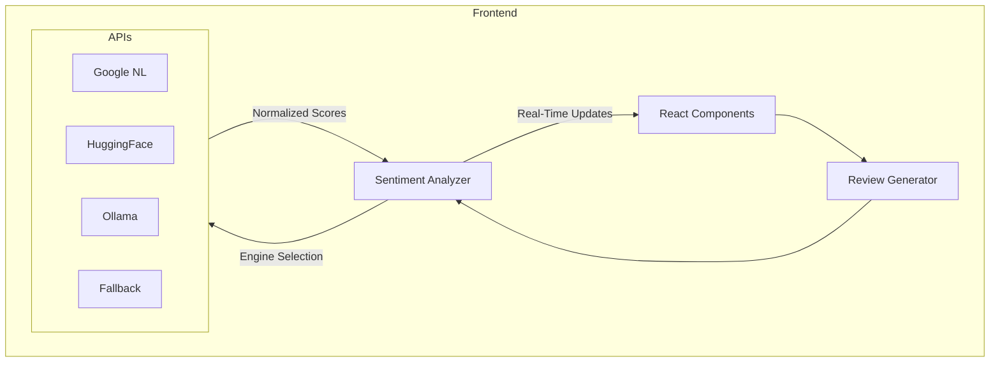

# Customer Review Analytics Dashboard 📊

A real-time customer review analytics platform that uses AI-powered sentiment analysis to provide actionable insights from customer feedback.

## 🌟 Features

- **Real-time Review Generation**: Simulates customer reviews with realistic data
- **Multi-Source Integration**: Handles reviews from X (Twitter), Instagram, Web, and Email
- **AI-Powered Sentiment Analysis**: Multiple sentiment analysis engines:
  - Google Natural Language API
  - HuggingFace
  - Ollama (Local)
  - Fallback (Rule-based)
- **Advanced Analytics**:
  - Sentiment distribution
  - Source analysis
  - Product performance metrics
  - Trend identification
- **Alert Management**: Proactive handling of negative reviews
- **Interactive Dashboard**: Real-time updates and visualizations

## Architecture



## Application Logic

```mermaid
graph TD
    A[Review Text] --> B{Analysis Engine}
    B -->|Primary| C[Google NL API]
    B -->|Secondary| D[HuggingFace]
    B -->|Local| E[Ollama]
    B -->|Fallback| F[Rule-Based]
    C --> G[Score: -1 to 1]
    D --> G
    E --> G
    F --> G
    G --> H{Categorization}
    H -->|≥ 0.2| I[Positive]
    H -->|≤ -0.2| J[Negative]
    H -->|Other| K[Neutral]
```


## 🚀 Getting Started

1. Clone the repository
2. Install dependencies:
   ```bash
   npm install
   ```
3. Set up environment variables in `.env`:
   ```env
   VITE_GOOGLE_API_KEY=your_google_api_key
   VITE_HUGGINGFACE_API_KEY=your_huggingface_api_key
   VITE_OLLAMA_HOST=http://localhost:11434  # Optional, defaults to http://localhost:11434
   VITE_SENTIMENT_ENGINE=fallback  # Options: google, huggingface, ollama, fallback
   ```
4. Start the development server:
   ```bash
   npm run dev
   ```

## 🛠 Tech Stack

- **Frontend**: React 18 with TypeScript
- **Styling**: Tailwind CSS
- **Charts**: Recharts
- **Icons**: Lucide React
- **Build Tool**: Vite
- **Testing**: Vitest (ready to implement)
- **Data Generation**: Faker.js

## 📊 Dashboard Sections

1. **Reviews Tab**
   - Real-time review feed
   - Sentiment indicators
   - Source tracking
   - Star ratings

2. **Analytics Tab**
   - Sentiment distribution pie chart
   - Review source analysis
   - Product performance metrics
   - AI-driven insights

3. **Alerts Tab**
   - Negative review management
   - Action items tracking
   - Response workflow
   - Resolution tracking

## 🎯 Sentiment Analysis Logic

The application uses a multi-tiered approach to sentiment analysis:

1. **Primary Analysis**:
   - Uses one of four configurable engines:
     - Google Natural Language API (returns score -1 to 1)
     - HuggingFace (converts label probabilities to -1 to 1 score)
     - Ollama (prompted to return score between -1 to 1)
     - Fallback (rule-based word matching, returns -1 to 1)
   - Each engine is configured to normalize scores between -1 (most negative) and 1 (most positive)

2. **Categorization**:
   ```typescript
   if (score >= 0.2) return 'positive'
   if (score <= -0.2) return 'negative'
   return 'neutral'
   ```

3. **Fallback System**:
   - Automatically switches to rule-based analysis if the selected engine fails
   - Uses predefined positive/negative word lists
   - Ensures continuous operation if API services are unavailable

## 🔄 Review Generation

The system generates realistic reviews using:
- Predefined templates
- Product categories
- Weighted sentiment distribution
- Realistic user data
- Varied review sources

## 📈 Performance Considerations

- Efficient state management
- Optimized rendering with React hooks
- Debounced API calls
- Responsive design for all screen sizes
- Error boundary implementation
- Fallback mechanisms for API failures

## 🔒 Security

- Environment variable protection
- API key security
- Rate limiting consideration
- XSS prevention
- CORS configuration

## 🤝 Contributing

Contributions are welcome! Please feel free to submit a Pull Request.

## 📝 License

This project is licensed under the Apache License - see the LICENSE file for details.

## 🙏 Acknowledgments

- Icons by Lucide React
- Charts by Recharts
- Fake data generation by Faker.js
- Styling system by Tailwind CSS